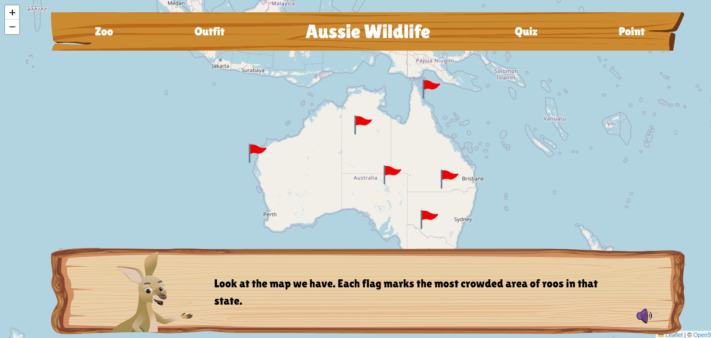
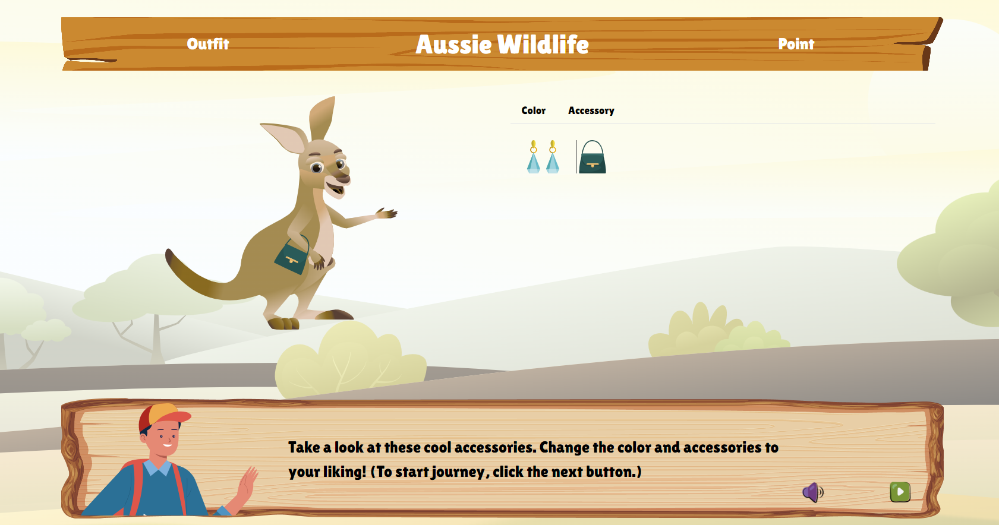
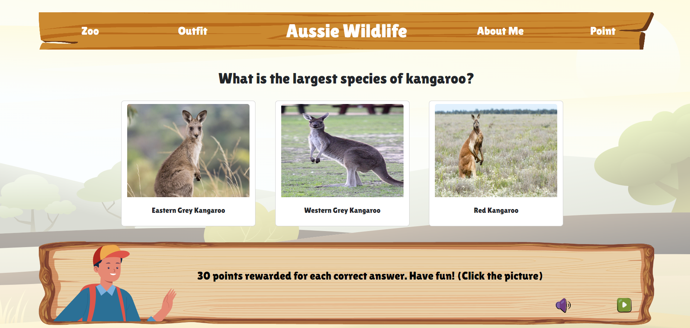
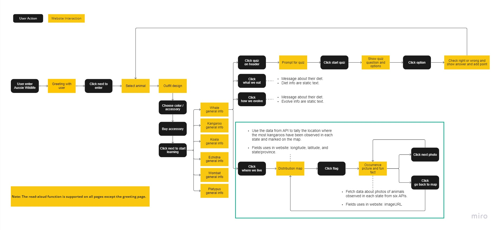

# Aussie Wildlife
This is a brief introduction of Aussie wildlife
1. [Introduction](#introduction)
2. [Purpose](#purpose)
3. [Key Features](#key-features)
4. [User Flow](#user-flow)
5. [Uses of API](#uses-of-api)
6. [Team Member](#team-member)
7. [External Resources](#external-resources)
8. [Reference](#refernce)
---

## Introduction
Aussie Wildlife is an educational initiative that uses game-based learning to bring the wonders of Australian wildlife closer to students, educators, and anyone interested in nature. Through a dynamic online platform, users can embark on a virtual journey through the diverse ecosystems of Australia, where they can discover, learn, and appreciate the beauty and significance of our native fauna.

## Purpose
Aussie Wildlife is dedicated to crafting an educational platform that transforms learning about Australian wildlife into an engaging and enlightening experience. Our primary goal is to cultivate a deep appreciation for Australia's vast biodiversity and underscore the pivotal role these creatures hold within their ecosystems.

Guided by this vision, our team has developed an interactive learning platform for children. Through an immersive RPG-style exploration, young learners can delve into the wonders of Australia's native fauna.

## Key Features

### Content sourced from real-time API
In the distribution map and specific regional animal photos, we utilize API data from ALA. In uses of API are the datasets employed in Aussie Wildlife. We've processed all the data to determine the most frequently observed locations in each state and highlighted them, allowing children to easily identify which parts of Australia have the highest observations of wild animals.

### RPG mode
Throughout the Aussie Wildlife website, we've designed it to resemble a role-playing game (RPG) to captivate children and boost their enthusiasm for learning. By integrating NPCs (Non-Playable Characters) on each page, we've introduced a storytelling feature that imparts knowledge about Australian native animals to children. To enhance this experience, the website offers the following functions:

**1. Read-out Function:** To address the readability concerns for our target audience, we've adapted our language to be more child-friendly. Moreover, feedback from previous user testing revealed that children are drawn to audio elements. Thus, the read-out function effectively heightens their engagement and interest.
**2. Outfit customization for the NPCs**

### Quiz
The primary objective of the learning process is to ensure children absorb the information and incorporate it into their knowledge base. Therefore, at the end of the website, there's a simple quiz to assess their understanding of the content presented earlier.

# User Flow

# Uses of API
| Name | Website Url | API Url | Filter |
|------|-------------|---------|--------|
| Wild kangaroos observed within Australia | [url](https://biocache.ala.org.au/occurrence/search?q=species_group%3AMammals%20AND%20country%3AAustralia%20AND%20basis_of_record%3APRESERVED_SPECIMEN%20AND%20taxa%3A%22Macropodidae%22%20AND%20institution_uid%3Ain4&qualityProfile=ALA&qc=-_nest_parent_%3A*&fq=occurrence_decade_i%3A%222010%22#tab_mapView) | [url](https://api.ala.org.au/occurrences/occurrences/search?q=species_group%3AMammals%20AND%20country%3AAustralia%20AND%20basis_of_record%3APRESERVED_SPECIMEN%20AND%20taxa%3A%22Macropodidae%22%20AND%20institution_uid%3Ain4&qualityProfile=ALA&fq=occurrence_decade_i%3A%222010%22&qc=-_nest_parent_%3A*) | **Country:** Australia **Institution:** Australian Museum **SpeciesGroup:** Mammals **Family:** Macropodidae **Time:** 2010 October |
| Photos of kangaroos observed in Queensland | - | [url](https://api.ala.org.au/occurrences/occurrences/search?q=taxa%3A%22kangaroo%22&qualityProfile=ALA&fq=occurrence_decade_i%3A%222020%22&fq=species_group%3A%22Mammals%22&fq=multimedia%3A%22Image%22&fq=data_resource_uid%3A%22dr1902%22&fq=state%3A%22Queensland%22&fq=month%3A%229%22&qc=-_nest_parent_%3A*) | **State:** Queensland **Taxon:** Kangaroo **Species Group:** Mammal **Time:** 2020 March | 
| Photos of kangaroos observed in New South Wales | [url](https://biocache.ala.org.au/occurrence/search?q=text%3Aobservation%20AND%20taxa%3A%22kangaroo%22&qualityProfile=ALA&fq=state%3A%22New%20South%20Wales%22&fq=occurrence_decade_i%3A%222020%22&fq=data_resource_uid%3A%22dr1411%22&fq=common_name%3A%22Red%20Kangaroo%22&qc=-_nest_parent_%3A*&fq=month%3A%221%22#tab_recordImages) | [url](https://api.ala.org.au/occurrences/occurrences/search?q=text%3Aobservation%20AND%20taxa%3A%22kangaroo%22&qualityProfile=ALA&fq=state%3A%22New%20South%20Wales%22&fq=occurrence_decade_i%3A%222020%22&fq=data_resource_uid%3A%22dr1411%22&fq=common_name%3A%22Red%20Kangaroo%22&fq=month%3A%221%22&qc=-_nest_parent_%3A*) | **State:** New South Wales **Institution:** iNaturalist Australia **Vernacular Name:** Red Kangaroo **Time:** 2020 January |
| Photos of kangaroos observed in South Australia | [url](https://biocache.ala.org.au/occurrence/search?q=text%3Aobservation%20AND%20taxa%3A%22kangaroo%22&qualityProfile=ALA&fq=occurrence_decade_i%3A%222020%22&fq=data_resource_uid%3A%22dr1411%22&fq=state%3A%22South%20Australia%22&fq=common_name%3A%22Red%20Kangaroo%22&qc=-_nest_parent_%3A*&fq=month%3A%226%22#tab_recordImages) | [url](https://api.ala.org.au/occurrences/occurrences/search?q=text%3Aobservation%20AND%20taxa%3A%22kangaroo%22&qualityProfile=ALA&fq=occurrence_decade_i%3A%222020%22&fq=data_resource_uid%3A%22dr1411%22&fq=state%3A%22South%20Australia%22&fq=common_name%3A%22Red%20Kangaroo%22&fq=month%3A%226%22&qc=-_nest_parent_%3A*) | **States:** South Australia **Institution:** iNaturalist Australia **Vernacular Name:** Red Kangaroo **Time:** 2020 June |
| Photos of kangaroos observed in Northern Territory | [url](https://biocache.ala.org.au/occurrence/search?q=text%3Aobservation%20AND%20taxa%3A%22kangaroo%22&qualityProfile=ALA&fq=state%3A%22Northern%20Territory%22&fq=occurrence_decade_i%3A%222010%22&qc=-_nest_parent_%3A*&fq=common_name%3A%22Red+Kangaroo%22#tab_recordImages) | [url](https://api.ala.org.au/occurrences/occurrences/search?q=text%3Aobservation%20AND%20taxa%3A%22kangaroo%22&qualityProfile=ALA&fq=state%3A%22Northern%20Territory%22&fq=occurrence_decade_i%3A%222010%22&fq=common_name%3A%22Red%20Kangaroo%22&qc=-_nest_parent_%3A*) | **States:** Northern Territory **Vernacular Name:** Red Kangaroo **Time:** 2010 |
| Photos of kangaroos observer in Western Australia | [url](https://biocache.ala.org.au/occurrence/search?q=text%3Aobservation%20AND%20taxa%3A%22kangaroo%22&qualityProfile=ALA&fq=state%3A%22Western%20Australia%22&fq=occurrence_decade_i%3A%222020%22&fq=multimedia%3A%22Image%22&fq=data_resource_uid%3A%22dr1902%22&fq=common_name%3A%22Western%20Grey%20Kangaroo%22&qc=-_nest_parent_%3A*&fq=month%3A%224%22#tab_recordImages) | [url](https://api.ala.org.au/occurrences/occurrences/search?q=text%3Aobservation%20AND%20taxa%3A%22kangaroo%22&qualityProfile=ALA&fq=state%3A%22Western%20Australia%22&fq=occurrence_decade_i%3A%222020%22&fq=multimedia%3A%22Image%22&fq=data_resource_uid%3A%22dr1902%22&fq=common_name%3A%22Western%20Grey%20Kangaroo%22&fq=month%3A%224%22&qc=-_nest_parent_%3A*) | **States:** Western Australia **Institution:** Earth Guardians Weekly Feed **Vernacular Name:** Western Grey Kangaroo **Time:** 2020 April **Multimedia**: Image |
| Photos of kangaroos observer in Australian Capital Territory| [url](https://biocache.ala.org.au/occurrence/search?q=text%3Aobservation%20AND%20taxa%3A%22kangaroo%22&qualityProfile=ALA&fq=state%3A%22Australian%20Capital%20Territory%22&fq=occurrence_decade_i%3A%222010%22&fq=multimedia%3A%22Image%22&fq=data_resource_uid%3A%22dr19123%22&fq=common_name%3A%22Eastern%20Grey%20Kangaroo%22&qc=-_nest_parent_%3A*&fq=month%3A%222%22#tab_recordImages) | [url](https://api.ala.org.au/occurrences/occurrences/search?q=text%3Aobservation%20AND%20taxa%3A%22kangaroo%22&qualityProfile=ALA&fq=state%3A%22Australian%20Capital%20Territory%22&fq=occurrence_decade_i%3A%222010%22&fq=multimedia%3A%22Image%22&fq=data_resource_uid%3A%22dr19123%22&fq=common_name%3A%22Eastern%20Grey%20Kangaroo%22&fq=month%3A%222%22&qc=-_nest_parent_%3A*) | **States:** Australian Capital Territory Australia **Institution:** NatureMapr **Vernacular Name:** Eastern Grey Kangaroo **Time:** 2010 February **Multimedia**: Image |

# External Resources
### Frontend Framework
[Bootstrap](https://getbootstrap.com/)
### Third Part API
Leaflet. (2023, May 18). Leaflet 1.9.4: a JavaScript library for interactive maps. Leaflet. https://leafletjs.com/
Mozilla. (n.d.). SpeechSynthesisUtterance. Mozilla Developer Network. https://developer.mozilla.org/en-US/docs/Web/API/SpeechSynthesisUtterance

# Team Member
Developed in the DECO7180 - Design Computing Studio course at the University of Queensland.

| Name | Program |
|----- |---------|
| Chia-Wen Kao | Master of Interaction Design |
| Thi Hong Nhung Le | Master of Entrepreneurship and Innovation |
| Li-Chih Tseng | Master of Interaction Design |
| Povie Pabia | Master of Entrepreneurship and Innovation |